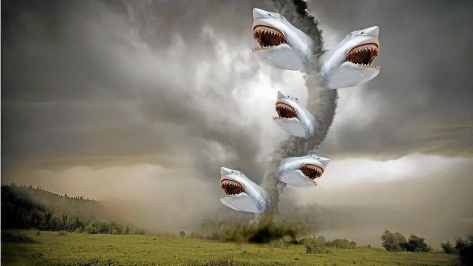

# Executive Summary {.unnumbered}

{#fig-sharknado}

## Purpose of Report

The insurance agency has seen a rise in property payouts driven by the intensifying effects of climate change on extreme weather. In the wake of the 'Sharknado' phenomenon sparked by the 2013 film, the agency is now investigating whether the increasing frequency of severe weather could lead to a higher likelihood of shark-infested weather events (as depicted in @fig-sharknado). The purpose of this report is to

-   **Determine the likelihood of sharknadoes forming.**
-   **Determine the economic impact of sharknadoes.**

## Background
Historically, the majority of tornadoes have occurred in the Central United States, a region nicknamed "Tornado Alley". Since this region is not near any coasts, the plausibility of a tornado picking up a shark out of coastal waters is low. However, there have been a few recorded tornadoes near the coast, leading the agency to wonder if sharknadoes are not an impossibility.

While there has not been any formal scientific literature that has studied the likelihood and impacts of tornadoes carrying sharks, one scholar, Dr. Kim Martini, entertained the idea and provided an analysis on the likelihood of a sharknado with her knowledge in marine biology and physics. Through logical reasoning, Martini concluded that while a typical tornado travels over enough geographic area and can be strong enough to keep a shark airborne, it is highly unlikely that a tornado could lift the shark out of the water in the first place. 

:::{.callout-note}
For the sake of still conducting a statistical analysis, this report ignores the above physical infeasibility.
:::

## Methods

75 years of tornado storm data (1950-2025) from the National Weather Service was analyzed to assess the likelihood and economic impact of a sharknado. After cleaning the data, a total of 31,345 storms were classified by path trajectory and shark-lifting potential (based on the Fujita scale) and analyzed for sharknado-likeness and total property damage.

A tornado's *path trajectory* was classified as one of three labels (see @fig-path-trajectories): 

<!-- -   **Moving Inland**: tornado originated on the coast and moved inland -->
<!-- -   **Moving Coastal**: tornado originated on inland and moved to the coast -->
<!-- -   **Other Path**: tornado originated either inland or on the coast and stayed in the same region of origin -->

{#fig-path-trajectories}

A tornado's *shark-lifting potential* was classified as one of two labels:

-   **Low Potential**: tornado was given an F1 or F2 rating on the (Enhanced) Fujita Scale
-   **High Potential**: tornado was given an F3, F4, or F5 rating on the (Enhanced) Fujita Scale

## Findings & Conclusions

Throughout the analysis, storms classified as "Moving Inland" and "High \[shark-lifting\] Potential" were of the highest interest as they exhibit characteristics most similar to a sharknado. Of the 31,345 recorded storms, only 2 were classified as both "Moving Inland" and "High Potential" for lifting sharks. While the Atlantic and Gulf coasts were the primary region of origin for "Moving Inland" storms, these events statistically lacked the same shark-lifting potential of storms originating inland. In terms of economic impacts, "Moving Inland" storm with high shark-lifting potential account for less that 0.01% of total historical property damage (\$183K over 75 years).

::: callout-tip
# Reccome

-   **Treat Marine-Origin Events as Rare Events:** High-intensity "Moving Inland" tornadoes remain an extreme statistical rarity, with only two recorded occurrences in 75 years. These should be categorized as low-probability, "long-tail" risks rather than primary drivers of annual catastrophe loss.
-   **Maintain Standard Inland Risk Models**: With 97.86% of historical property damage occurring in "Other Path" trajectories, the agency should continue prioritizing traditional inland tornado risk models over specialized "Sharknado" or marine-origin coverages.
-   **Monitor Southeast Regional Shifts:** While national "Sharknado" risk is negligible, the Gulf and Atlantic coasts account for the vast majority of coastal-to-inland storm paths. The agency should periodically track storm trends in the Southeastern U.S., where climate change *may* be increasing the frequency of atypical, high-intensity coastal events.
:::

<!-- You are a data scientist for a mid-sized business, in a small group of 3-4 data scientists. You've been tasked with creating a report evaluating a scenario for your business. Your colleagues will also be evaluating the same scenario, and your reports will be used in aggregate to determine a consensus (or lack thereof) on the company's action. The reports will also be used to inform downsizing that is rumored to be coming - you want to ensure your report is better than your peers so that you aren't as easy to cut. -->

<!-- You may talk to your peers who are assigned the same scenario, but you do not want to collaborate too closely, lest you both become targets of the rumored layoffs. -->

<!-- ------------------------------------------------------------------------ -->

<!-- I've scaffolded this report for you to make this process easier - as we talk about different sections of a report in class and read about how to create similar sections, you will practice by writing the equivalent section of your report. -->

<!-- The basic steps for this task are as follows: -->

<!-- -   Identify the research question from the business question -->

<!-- -   Identify data set(s) which are (1) publicly available (you don't have a budget to pay for private data) and (2) relevant to your task -->

<!--     -   (HW Week 6) Document your data sets in `draft-data-doc.qmd` -->

<!-- -   Conduct a statistical analysis to support your answer to your research and business questions -->

<!--     -   Write a methods section for your business report corresponding to your statistical analysis -->

<!--     -   (HW Week 9) Draft of results section of business report with relevant graphics/visual aids in `draft-results.qmd` -->

<!-- -   Write your report -->

<!--     -   (HW Week 10) Draft of Intro/Conclusion sections in `draft-intro-conclusions.qmd` -->

<!--     -   (HW Week 11) Draft of Executive summary section in `draft-exec-summary.qmd` -->

<!-- -   Revise your report -->

<!--     -   (HW Week 12 -- not turned in) Revise your report -->

<!--     -   (HW Week 13) - Rough draft of report due. Create one or more qmd files for your report (you can overwrite or delete intro.qmd and summary.qmd), include the names of each file (in order) in `_quarto.yml`. You should use references (edit references.bib and use pandoc citations). Make sure your report compiles and looks reasonable in both html and pdf. -->

<!--     -   Develop a presentation to go along with your report (Week 13). Create slides for your report using quarto. -->

<!-- -   Peer revise reports -->

<!--     -   Peer revise reports -->

<!--     -   (HW Week 14) - Make edits to your report from comments received from peer review -->

<!-- -   Final report & presentation due -->
