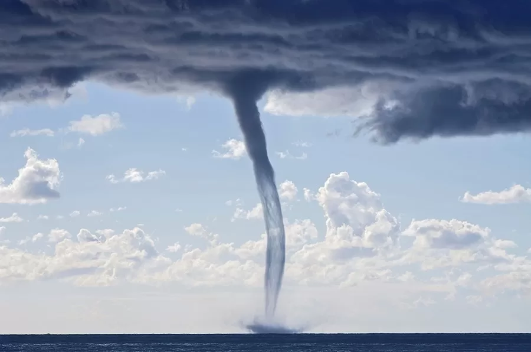

# Introduction {#sec-introduction}

Before the release of the movie, Sharknado [@Sharknado], most people probably had not thought about the possibility of a tornado close enough to water and so powerful that it could pick up a shark and hurl it onto the land. However, with the recent rise in extreme weather events due to climate change [@TornadoesClimateChange], Anthony Ferrante's idea of a sharknado in today's climate environment may not be as laughable as it was back in 2013. Thus, there exists a motivation to investigate if sharknadoes could become a real threat to the safety of our communities (and the profitability of insurance companies).

Historically, we have seen tornadoes primarily occurring in Central United States region, which has gained the nickname "Tornado Alley" (see @fig-tornado-alley). Tornadoes typically last for a few minutes and travel for short distances of 1 to 5 miles, though long-track events can exceed 50 miles. The intensity of a tornado is ranked on a scale of EF0 to EF5; while the original Fujita (F) scale was used historically, the modern Enhanced Fujita (EF) scale focuses on degrees of damage to better estimate wind speeds [@centerNOAAsNWSStorm]. Under this system, an EF1 tornado is strong enough to do moderate damage, such as stripping roof surfaces or upsetting mobile homes, while an EF5 tornado is strong enough to lift incredibly heavy objects—including automobiles and entire frame houses—and cause incredible structural devastation (see @fig-ef-scale).

![This is map highlights the Central United States, historically referred to as Tornado Alley [@TornadoAlley2026].](assets/Tornado_Alley_Diagram.png){#fig-tornado-alley}

![This is a diagram illustrating the strength, wind speed, and damage typically caused by a tornado at each classification on the Enhanced Fujita Scale [@WhatTornadoLets2020].](assets/EF_Scale.png){#fig-ef-scale}

Additionally, the 75 years of tornado data provided by the NOAA [@StormEventsDatabasea] (which we will later analyze in more detail) records a small, but not impossible, set of coastal tornado occurrences. With various species of sharks existing along the Atlantic, Pacific, and Gulf Coasts of the US, a coastal tornado’s "inventory" of sharks is not limited to any specific region [@fisheriesSharksAtlanticGulf2025]. Furthermore, with an increasing number of tornadoes in atypical regions such as the Southeastern United States [@TornadoesClimateChange], tornadoes' proximity to sharks and ability to pick them up may be increasing as well.

While there has not been any formal scientific literature that has studied the likelihood and impacts of tornadoes carrying sharks, one scholar, Dr. Kim Martini, entertained the idea and provided an analysis on the likelihood of a sharknado with her knowledge in marine biology and physics [@martiniRecipeSharknadoDeep2013]. Her analysis resulted in several conclusions:

1.  **A typical tornado flying over a typical reef could pick up about** **150 sharks**. \
    *Rationale*: A typical tornado is about 0.1 miles wide, travels about 5 miles, and covers an area of 0.5 square miles. A healthy reef typically has a shark density of about 300 sharks per square mile. However, she notes that one of the largest tornadoes in history was 2.6 miles wide and traveled 52 miles [@2004HallamTornado2026], making it hypothetically capable of picking up over 40,000 sharks.
2.  **It is highly unlikely that a tornado could suck a shark out of the water.\
    ***Rationale*: Tornadic water spouts (see @fig-water-spout) don't typically suck up water, and tagged sharks typically dive deep when there are approaching thunderstorms (which can cause tornadoes).
3.  **Intense tornadoes are strong enough to keep a shark airborne.\
    ***Rationale*: In the event that a tornado does pick up a shark (e.g., a shark hypothetically jumps out of the water as a tornado passes over contrary to typical observed behavior), the tornado would need to have strong enough vertical wind speeds to combat the force of gravity on the shark. With basic physics equations and conservative estimates, the minimum upward wind speed required to keep an average Great White Shark in the air is 127 mph, which a strong EF4 tornado has shown to exhibit. Additionally, smaller sharks are even lighter and would require less force to keep them airborne.
    
{#fig-water-spout}

Using this logic, we can assume that EF3 tornadoes (and larger) are strong enough to pick up small sharks, given that the shark was transported from the water into the tornado by some odd means. This transportation of the shark from water to tornado already makes the occurrence of a sharknado highly unlikely. However, for the purposes of this report, we will ignore this improbability and assume the physical transport of sharks is possible, so we can continue analyzing the geographic and economic frequency of the storm paths themselves.

While tornado intensity is well-studied and the ability for a high intensity tornado to pick up a shark has been logically proven, there is a gap in the analysis of the two together. To ensure the profitability of the insurance agency, we need to know how serious is the threat of sharknadoes to the insurance agency's bottom line given the warming climate and shifting trends in tornado activity. Thus, we will use the historical data found in the NOAA Storm Events Database to evaluate the likelihood and economic impact of a high-intensity tornado with a coastal-origin moving inland (since these are the types of tornadoes that have the ability to transport sharks from the ocean) to answer the research question:

***What is the historical frequency, probability, and economic impact of high-intensity tornadoes (F3, F4, and F5) originating in coastal areas (Atlantic, Pacific, and Gulf of Mexico) and moving inland, compared to those following other trajectories?***