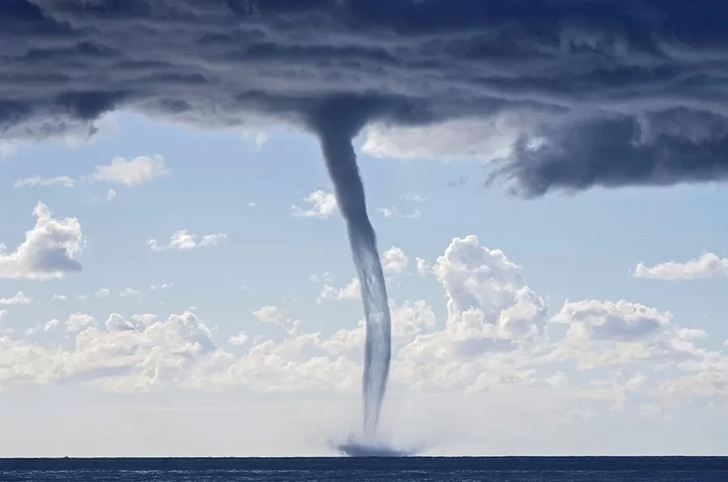
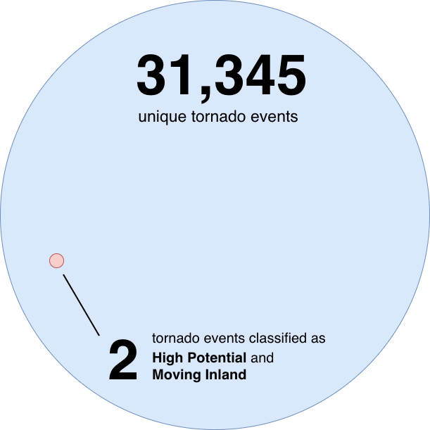

## Introduction

The 2013 film *Sharknado* is fiction...

{#fig-sharknado-movie}

## Introduction

...but intensifying extreme weather due to climate change is a reality for our insurance agency.

{#fig-climate-change}

## The Problem

With rising property payouts, is "shark-infested weather" a valid new risk category or a statistical impossibility?

{#fig-sharknado}

## Background

::: {style="font-size: 0.85em;"}
- Tornadoes historically occur in the Central U.S. ("Tornado Alley") 
- Increasing number of tornades in atypical regions (Southeastern U.S.)^[Source: @TornadoesClimateChange]

<!-- tornadoes' proximity to sharks and ability to pick them up may be increasing as well. -->
:::

![This is map highlights the Central United States, historically referred to as Tornado Alley [@TornadoAlley2026].](assets/Tornado_Alley_Diagram.png){#fig-tornado-alley width="40%"}

## Background

::: {style="font-size: 0.85em;"}
Tornado intensity is classified using the **Enhanced Fujita Scale** (F0-F5) based on strength, windspeed, & damage.
<!-- tornadoes' proximity to sharks and ability to pick them up may be increasing as well. -->
:::

![This is a diagram illustrating the strength, wind speed, and damage typically caused by a tornado at each classification on the Enhanced Fujita Scale [@WhatTornadoLets2020].](assets/EF_Scale.png){#fig-ef-scale}


## Background

::: {.columns}

::: {.column width="60%"}
::: {style="font-size: 0.85em;"}
Dr. Kim Martini’s physical analysis^[Source: @martiniRecipeSharknadoDeep2013]:

1.  It is **highly unlikely** that a tornado could suck a shark out of the water.
2.  Intense tornadoes (F4) are **strong enough** to keep a great white shark airborne.
3.  A typical tornado flying over a typical reef could pick up about **150 sharks**.

:::
::: 

::: {.column width="40%"}
{#fig-water-spout}
:::

:::

::: aside
*For the sake of still conducting a statistical analysis, this report ignores this physical infeasibility.*
:::


## Research Question

::: {style="text-align: center; margin-top: 1em;"}
*What is the historical frequency, probability, and economic impact of high-intensity tornadoes (F3, F4, and F5) originating in coastal areas (Atlantic, Pacific, and Gulf of Mexico) and moving inland, compared to tornadoes following other trajectories?*
:::


## Data Sources

::: {.columns style="display: flex; gap: 40px;"}

::: {.column width="45%" style="background-color: #f0f4f8; padding: 25px; border-radius: 15px; font-size: 0.8em;"}
**NOAA Storm Events Database^[Source: @StormEventsDatabasea]** 

- Records from 1950 to 2025 
- Comprehensive official records of US tornadic activity
- Provides metrics for intensity, location, and property damage
:::

::: {.column width="45%" style="background-color: #f0f4f8; padding: 25px; border-radius: 15px; font-size: 0.8em;"}
**US Coastline Shapefile^[Source: @TigrisPackageRDocumentation]**

- Established using the R package `tigris`
- 2025 United States coastline data
- Used to establish geographic boundaries between "Coast" and "Inland"
:::

:::

## Methodology

::: {.columns style="display: flex; gap: 40px;"}

::: {.column width="50%"}

**Defining the "Sharknado":**

  1. Coastal origin
  2. High intensity (F3-F5)
  3. Inland trajectory
  
**Defining "Coast" vs. "Inland":** 

A 3-mile buffer zone (1.5 miles into water, 1.5 miles onto land).
:::

::: {.column width="50%"}

{#fig-us-coastline width="100%"}
:::
:::

## Methodology

- Step 1: Data pre-processing & filtering

::: {style="background-color: #f0f4f8; padding: 25px; border-radius: 15px; font-size: 0.8em;"}
  -   Filter Storm Events Database for "Tornado" storm types
  -   Remove records with missing data
  
:::

## Methodology

- Step 1: Data pre-processing & filtering
- Step 2: Classify each tornado's trajectory

{#fig-path-trajectories}

## Methodology

- Step 1: Data pre-processing & filtering
- Step 2: Classify each tornado's trajectory
- Step 3: Classify each tornado's shark-lifting potential

::: {style="background-color: #f0f4f8; padding: 25px; border-radius: 15px; font-size: 0.8em;"}
  -   **Low Potential**: F0, F1, or F2 rating on the (Enhanced) Fujita Scale
  -   **High Potential**: F3, F4, or F5 rating on the (Enhanced) Fujita Scale
  
:::


## Results

**Which tornadoes are "Sharknadoes"?**

- High Potential (F3-F5)
- Moving Inland

## Results: Frequency

<!-- 1 in 15,673 -->

{#fig-circle-diagram}


<!-- - **The Rare Event:** Out of 31,345 tornadoes, only **73** moved from coast to inland.  -->
<!-- - Only **2** of those were "High Potential" (F3+) storms. -->
<!-- - **Empirical Probability:** 0.0064% (roughly 1 in 15,673 events). -->
<!-- - **Regional Risk:** Almost exclusively an Atlantic and Gulf Coast phenomenon (only 1 low-potential storm recorded on the Pacific coast). -->

## Results: Frequency

```{r}
#| echo: false
#| warning: false
#| label: fig-trajectory-intensity
#| fig-cap: "Categorized all tornadoes by path trajectory and visualized the percentages of high vs. low shark-lifting potential within each path trajectory group."
library(ggplot2)
library(dplyr)

final_glued_events <- readRDS("final_glued_events.rds")

plot_data <- final_glued_events %>%
  count(path_movement, shark_lifting_potential) %>%
  group_by(path_movement) %>%
  mutate(percent = n / sum(n))

ggplot(plot_data, aes(x = path_movement, y = percent, fill = shark_lifting_potential)) +
  geom_bar(stat = "identity", position = "fill", color = "white") +
  scale_y_continuous(labels = scales::percent_format()) +
  scale_fill_manual(values = c("High Potential" = "#b2182b", "Low Potential" = "#4393c3")) +
  theme_minimal() +
  labs(
    title = "Relative Tornado Intensity by Path Trajectory",
    subtitle = "Comparing the likelihood of High Potential (F3/F4/F5) events by path trajectory",
    x = "Tornado Path Category",
    y = "Percentage of Events",
    fill = "Intensity Category"
  ) +
  theme(
    legend.position = "bottom",
    plot.title = element_text(face = "bold", size = 14),
    axis.text = element_text(size = 10)
  )
```

<!-- Categorized by path trajectory. The red is the percentage of high intensity tornadoes for that path trajectory.  -->

<!-- Across the different trajectory types, high-intensity storms are a minority. They are more common for "Other Path" (inland) storms, they are super rare for coastal tornadoes either starting or ending on the coast. -->

<!-- - Atmospheric conditions needed for F3/F4/F5 tornadoes are far more prevalent once a storm has moved inland. -->

## Results: Regional Risk

```{r}
#| echo: false
#| warning: false
#| label: fig-moving-inland-regions
#| fig-cap: "Categorized only 'Moving Inland' trajectory tornadoes by coastal region and visualized the percentages of high vs. low shark-lifting potential within each coastal region group."
library(ggplot2)
library(dplyr)
library(scales)

regional_plot_data <- final_glued_events %>%
  filter(path_movement == "Moving Inland") %>%
  group_by(Start_coast, shark_lifting_potential) %>%
  summarize(count = n(), .groups = "drop")

ggplot(regional_plot_data, aes(x = reorder(Start_coast, -count, sum), y = count, fill = shark_lifting_potential)) +
  geom_bar(stat = "identity", width = 0.7) +
  scale_fill_manual(values = c("High Potential" = "#b2182b", "Low Potential" = "#4393c3")) +
  theme_minimal() +
  labs(
    title = "Regional 'Moving Inland' Activity",
    subtitle = "Frequency of coastal-origin tornadoes by region and lifting potential",
    x = "Coastal Region",
    y = "Total Number of Events",
    fill = "Potential Category"
  ) +
  theme(
    legend.position = "top",
    panel.grid.major.x = element_blank(),
    plot.title = element_text(face = "bold", size = 14)
  )
```

<!-- Looking only at the storms that were classified as "Moving Inland" (so they started on the coast and moved inland) only two total storms were also high intensity (and they originated on the atlantic coast). -->

<!-- Overall we can see the "Moving Inland" storms occur more in the eastern region (Atlantic and Gulf) than the western pacific coasts. So if storm intensity continues to rise with climate change, we'd want to pay attention to the eastern US coasts for sharknado risk.  -->

## Results: Economic Impact
Across 75-years of data

::: {style="background-color: #f0f4f8; padding: 25px; border-radius: 15px; font-size: 0.8em;"}
- Total tornado damages: **\$3.33B**
- Average damage per tornado: **\$106K**
:::

\n

::: {style="background-color: #FFFFFF; padding: 20px"}
:::

::: {style="background-color: #f0f4f8; padding: 25px; border-radius: 15px; font-size: 0.8em;"}
- Total "sharknado" damages: **\$183K**  
- Average damage per "sharknado": **\$91.5K** (2 storms)
:::


## Results: Economic Impact

```{r}
#| echo: false
#| warning: false
#| label: fig-trajectory-damage-total
#| fig-cap: "Categorized all tornadoes by trajectory and visualized the total property damage inflicted by high vs. low shark-lifting potential tornadoes within each path trajectory group."

library(ggplot2)
library(dplyr)
library(scales)

damage_plot_data <- final_glued_events %>%
  group_by(path_movement, shark_lifting_potential) %>%
  summarize(total_loss = sum(Total_Damage, na.rm = TRUE), .groups = "drop")


ggplot(damage_plot_data, aes(x = path_movement, y = total_loss, fill = shark_lifting_potential)) +
  geom_bar(stat = "identity", position = "dodge", width = 0.7) + 
  scale_y_continuous(labels = label_dollar(scale = 1e-6, suffix = "M")) +
  scale_fill_manual(values = c("High Potential" = "#b2182b", "Low Potential" = "#4393c3")) +
  theme_minimal() +
  labs(
    title = "Cumulative Economic Impact by Trajectory and Intensity",
    subtitle = "Total property damage (1950-2025) grouped by Path Trajectory and Shark-Lifting Potential",
    x = "Tornado Path Category",
    y = "Total Property Damage (Millions USD)",
    fill = "Lifting Potential"
  ) +
  theme(
    plot.title = element_text(face = "bold"),
    legend.position = "bottom"
  )
```

<!-- When comparing the different tornado path trajectories, "Other Path" (inland) tornadoes caused the majority of all time damages. The all time damage from the other categories was negligible in comparison to traditional "tornado alley" storms.-->

## Conclusion

- **Frequency:** 
  - Sharknado-like events are extremely rare
  - **0.0064%** of cases (1 in 15,673 events)
  - Standard inland tornadoes dominate tornadic activity
- **Regional Risks**
- **Economic Impacts**

## Conclusion

- **Frequency**
- **Regional Risks:** 
  - Higher potential sharknado risk in **Atlantic and Gulf Coasts**
  - East coast accounts for nearly all "Moving Inland" trajectories (storms are still low intensity)
  - Pacific Coast has negligible risk
- **Economic Impacts**

## Conclusion

- **Frequency**
- **Regional Risks**
- **Economic Impacts:** 
  - Economic threat of sharknadoes is minimal 
  - Only **$183K** (less than 0.01%) to total property damages over 75 years

## Going Forward

::: callout-tip
## Action Items

::: {style="font-size: 1.5em"}
1. **Treat coastal-origin events as rare risks:** These are "long-tail" risks, not primary drivers of loss.
2. **Maintain standard inland risk models:** Continue prioritizing traditional inland tornado risk where 97.86% of historical damage occurs.
3. **Monitor Southeast shifts:** Track storm trends in the Southeastern U.S. where climate change may be gradually increasing coastal events.
:::
:::

## Questions?

**Thank you for your time.**


## References


