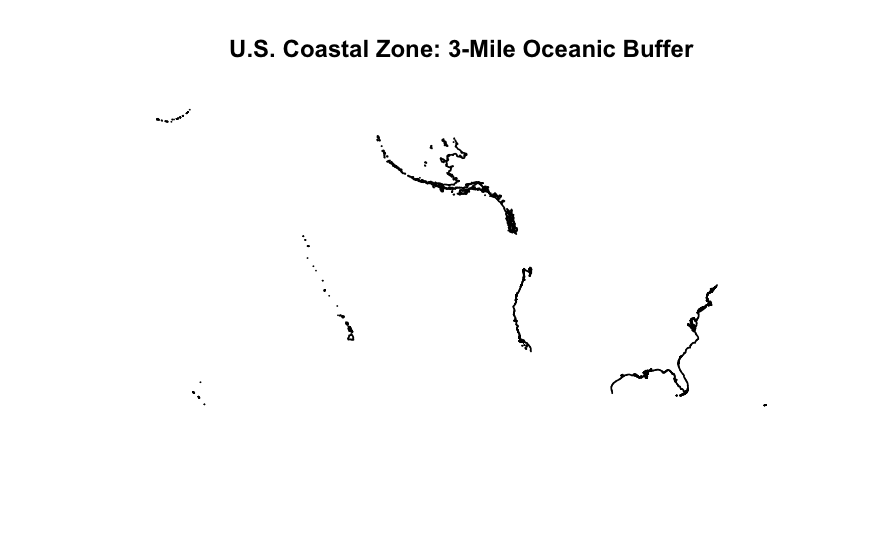
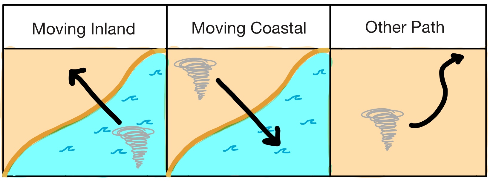

# Technical Methodology {#sec-tech-methods}

## Data Pipeline

:::callout-note
See @fig-data-pipeline for a diagram of the full data pipeline.
::: 

### US Coastline Data {#sec-coastline-data-tech}

To implement the above definition of "Coast" and "Inland" (see @sec-define-sharknado), the R package `tigris` was used to provide a shapefile of the US Coastline. Once the original coastline shapefile was imported, it was filtered to only include the Atlantic, Pacific, and Gulf of Mexico coasts as requested in the original scenario prompt. The units of the coastline data were converted from degrees to meters using the `st_transform` function from the `tigris` package prepare for a meter-based buffer. Using the `st_buffer` function from the `tigris` package, a 3-mile (4828 meter) buffer was equally centered over the coastline, resulting in a zone that extends 1.5 miles into the ocean and 1.5 miles onto the land. Any point within this buffer zone is considered the "Coast" for the purposes of this analysis. Any point further inland than the buffer zone is considered "Inland". Finally, any coastline details smaller than 100m were smoothed using the `st_simplify` function from the `tigris` package to increase computational efficiency without sacrificing regional accuracy. A visual representation of this data can be seen in @fig-coast-buffer.

{#fig-coast-buffer}

### NOAA Storm Event Database

#### Pre-cleaning & Filtering

To begin processing the NOAA Storm Events Database, we `filter` the data to only include events that are `EVENT_TYPE = Tornado`. Additionally, any entries that are missing location coordinates for the features `BEGIN_LAT`, `BEGIN_LON`, `END_LAT`, `END_LON` were removed since we wouldn't be able to calculate their path trajectories. Finally, any features **not** in the following list were removed since they were not needed for the analysis:

-   `EPISODE_ID`

-   `EVENT_ID`

-   `YEAR`

-   `MONTH_NAME`

-   `BEGIN_DATE_TIME`

-   `STATE`

-   `BEGIN_LAT`

-   `BEGIN_LON`

-   `END_LAT`

-   `END_LON`

-   `TOR_F_SCALE`

-   `DAMAGE_PROPERTY`

#### Geographical Classifications

Beginning the work needed to classify tornado path trajectories, we started by engineering two new features `Start_coast` and `End_coast`, which classify the tornado segment as starting/ending in the "Atlantic", "Pacific", "Gulf", or N/A. This is done by comparing the `BEGIN_LAT`, `BEGIN_LON`, `END_LAT`, `END_LON` features to the modified coastline shapefile.

From here, two more features were created `Start_location` and `End_location`, which classify the tornado segment as starting/ending on the "Coastal" or "Inland" based on whether the `Start_coast` and `End_coast` columns are empty for the feature.

#### Aggregate Storm Segments {#sec-aggregate-segments-tech}

NOAA Storm Events Database is structured so that a single storm may be recorded as multiple different storm segments. A new storm segment is created when the tornado enters a new county or zone, resulting in multiple data rows corresponding to one storm. Post-1996, segments belonging to the same storm have been connected using a unique identifier found in the column named `EPISODE_ID`, making the process of connecting segments relatively straightforward. However, storms occurring before 1996 do not have a value in the `EPISODE_ID` column. To connect storm segments from this era, we matched segments' dates, times, and start/end location coordinates.

Once tornado segments were stitched together into one full tornado entry, a new feature, `master_id`, was created to serve as an ultimate unique identifier for each full tornado. For pre-1996 storms, the unique `master_id` was formatted as `YEAR MONTH_NAME STATE BEGIN_LAT BEGIN_LON` (e.g., 1950 September OKLAHOMA 35 -96.25). For post-1996 storms, the `EPISODE_ID` was used for the `master_id` since it is already a unique identifier for each full storm.

Because multiple tornado segments were stitched together, we needed to consolidate all of the data from each of the segments into a single entry. The following list summarizes how the data was consolidated for each feature:

-  `YEAR`: use the year of the first segment
-  `MONTH_NAME`: use the month name from the first segment
- `Beginning_State`: use the state of the first segment
- `End_State`: use the state of the last segment
- `Start_location`: use the start location of the first segment
- `End_location`: use the end location of the last segment
- `Start_coast`: use the start coast of the first segment
- `End_coast`: use the end coast of the last segment
- `TOR_F_SCALE_MAX`: maximum (Enhanced) Fujita scale ranking across all segments
- `Total_Damage`: sum of `DAMAGE_PROPERTY` across all segments 

From here, a new feature `path_movement` was created, which classifies the path trajectory of the full tornado as "Moving Inland", "Moving Coastal", or "Other Path" based on the `Start_location` and `End_location` features. Below further describes the characteristics of each path trajectory, along with an illustration in @fig-path-trajectories.   

-   **Moving Inland**: tornado originated on the coast and moved inland.

-   **Moving Coastal**: tornado originated inland and moved to the coast.

-   **Other Path**: tornado originated either inland or on the coast and stayed in the same region of origin.

{#fig-path-trajectories}

Finally, a new feature `shark_lifting_potential` was created, which classifies the shark-lifting potential of the full tornado as "High Potential" or "Low Potential", based on the `TOR_F_SCALE_MAX` feature. Below further describes the characteristics of these labels:

-   **Low Potential**: tornado was given an F1 or F2 rating on the (Enhanced) Fujita Scale
-   **High Potential**: tornado was given an F3, F4, or F5 rating on the (Enhanced) Fujita Scale

{#fig-data-pipeline}